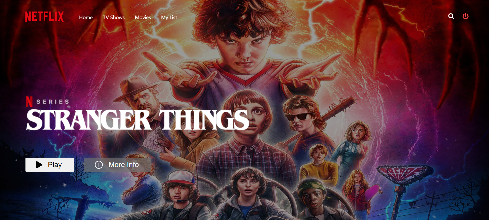
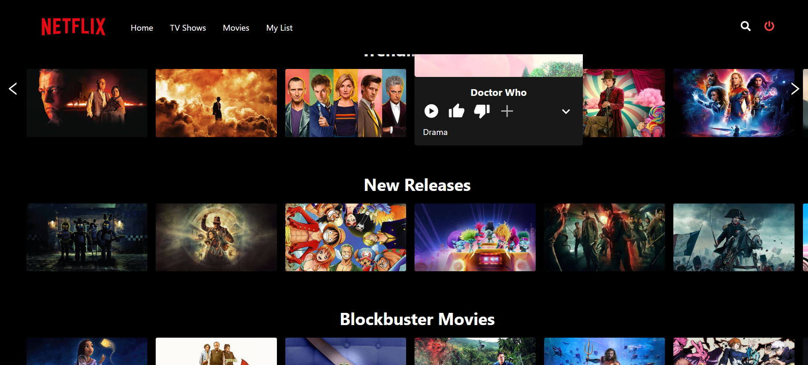
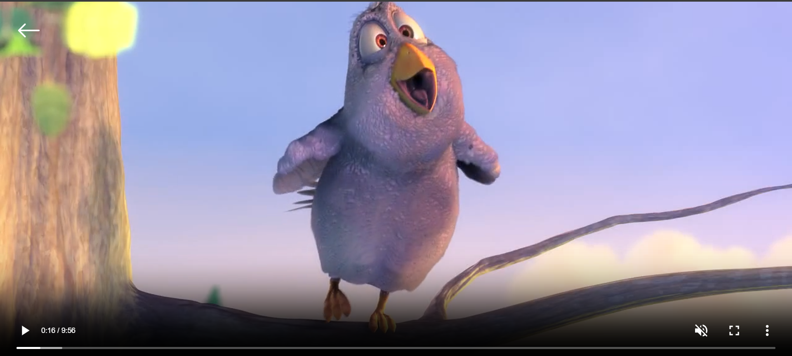
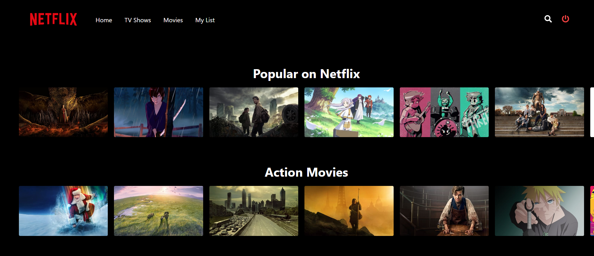
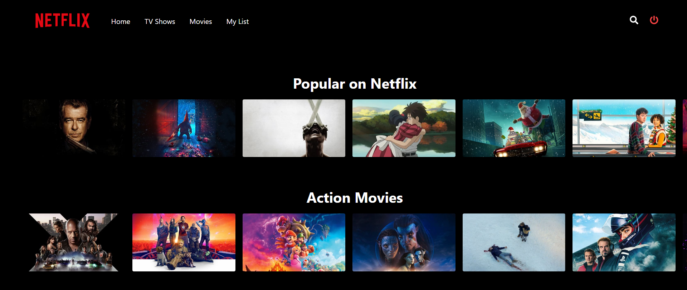
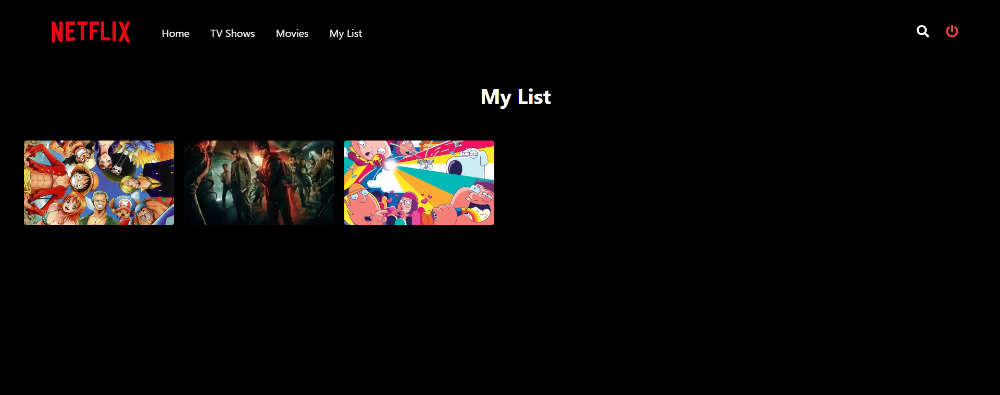

## Netflix Clone

This application combines React, Redux Toolkit, Axios, and React Router DOM to deliver a seamless and intuitive user experience. Utilizing Firebase for secure authentication and real-time data updates, and styled components with React Icons for look. The backend, powered by Express, MongoDB, and Mongoose, ensures a robust and scalable foundation.

#

### Home Page

#

#

### Video Player

#

### Tv Shows

#

### Movies

#

### My List

#

## To start the Web app

- Install React Dependencies
- Instal Node Dependencies
- Start Node App
- Start React App

#
